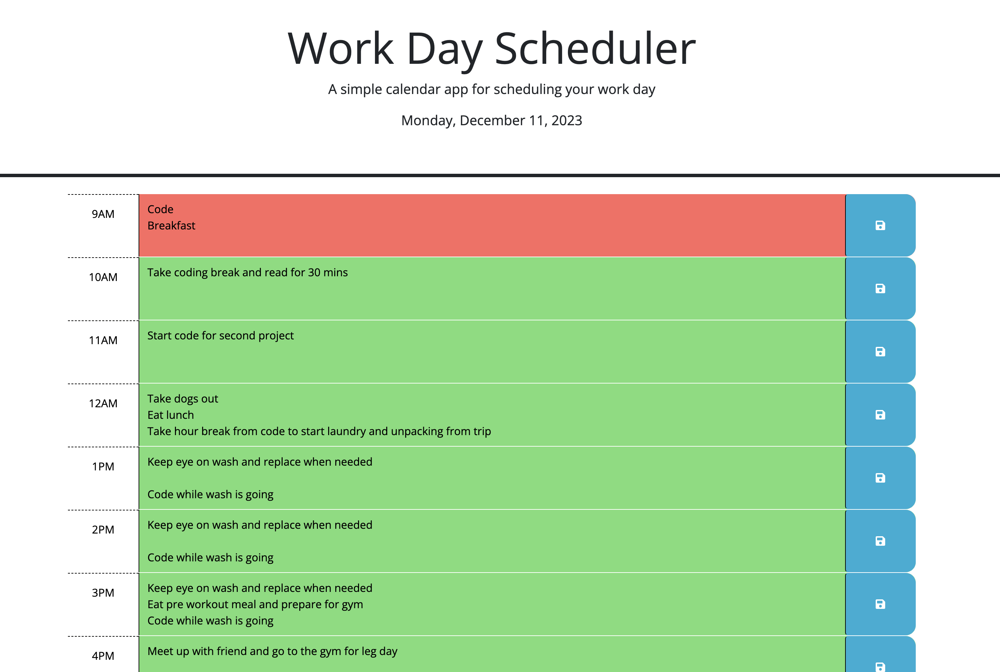

# Work Day Scheduler

## Overview

The Work Day Scheduler is a simple calendar application designed to help users efficiently schedule their workday. This web application allows users to input and save tasks for specific hours of the day, providing a visual representation of past, present, and future activities.

## Deployed Site Demo 

## Features

- **Intuitive Interface:** A user-friendly interface that allows users to easily input and save tasks for each hour of the workday.

- **Dynamic Styling:** The application dynamically styles each time block based on the current time, providing a clear visual indication of past (gray), present (red), and future (green) tasks.

- **LocalStorage Integration:** User inputs are stored in the browser's localStorage, ensuring that tasks persist even when the page is refreshed or closed.

## Usage

1. Visit the [Work Day Scheduler](#) website.
2. Scroll through the hours of the day.
3. Input and save tasks for each hour.
4. Observe the dynamic styling that indicates the temporal status of each task.
5. Come back later and mark off your tasks!

## Installation

No installation is required for this web application. Simply access the site using a web browser that supports HTML, CSS, and JavaScript. If confused or having any issues with accessing the site please refer to my contact section below.

## Technologies Used

- **HTML:** Markup language for structuring the content of the web application, apart of my front-end learning.
- **CSS:** Styling language for enhancing the visual appeal of the site, apart of my front-end learning.
- **JavaScript:** Programming language for adding interactivity and dynamic behavior, apart of my back-end learning.
- **Bootstrap:** Front-end framework for a responsive and mobile-first design.
- **jQuery:** JavaScript library for simplified DOM manipulation.
- **Day.js:** Library for parsing, validating, manipulating, and formatting dates. It was very important and useful to me in this project.

## Contact

For any questions, praise, or support, please contact me at danelarsen12@gmail.com or 801-560-8796. 

